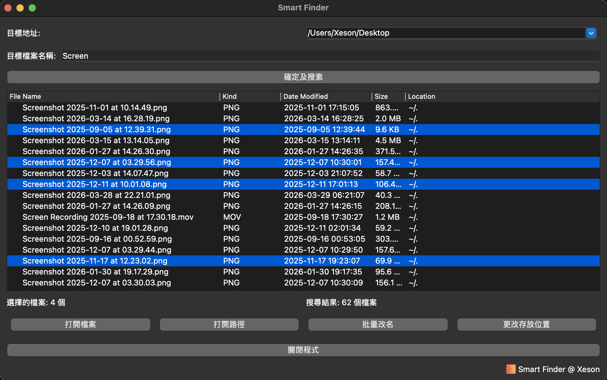

# Smart Finder

**一款專為 macOS 設計的智能檔案搜尋與批量管理工具**

[功能特色](#-功能特色) • [下載安裝](#-下載安裝) • [使用教學](#-使用教學) • [打包說明](#-開發者打包說明) • [更新紀錄](#-更新紀錄-release-notes)

---

## 📖 簡介

**Smart Finder** 是一款基於 PyQt5 開發的 macOS 桌面應用，旨在解決 Finder 在大量檔案管理時的不足。它讓你能夠在指定資料夾中快速搜尋符合關鍵字的檔案，並提供 **一鍵批量打開、批量改名、批量搬移** 等高效操作，是設計師、影片剪輯師、文檔整理者與一般使用者的好幫手。

> 💡 適用情境：素材整理、檔案歸檔、批量重新命名（加 Prefix / Suffix / 全名重新編號）、跨資料夾檔案管理。

---

## ✨ 功能特色

- 🌐 **雙語介面（v8.1.0 新增）**：完整支援 **English / 繁體中文**，所有按鈕、標籤、訊息框、欄位標題皆已國際化。
- 🎚 **左下角語言切換拉桿（v8.1.0 新增）**：主視窗左下角設有 `EN ⇄ 中文` 拉桿（QSlider），即時切換無需重啟 App。
- 💾 **語言偏好持久化（v8.1.0 新增）**：語言選擇會保存於 `Smart_Finder_settings.json`，下次啟動自動沿用；首次啟動預設為 **English**。
- 🔍 **智能模糊搜尋**：輸入關鍵字即可在目標目錄（含所有子目錄）中遞迴搜尋符合的檔案。
- 🗂 **詳細檔案資訊**：一覽檔名、檔案類型（Word / Excel / PDF / MOV / MP3 / AI / PSD…）、修改日期、檔案大小與相對路徑。
- 🕘 **最近目錄記憶**：自動保存最近 5 個搜尋過的目錄，方便快速切換。
- 📂 **批量打開檔案**：一次選擇多個檔案直接以系統預設程式打開（>5 個檔案會貼心提醒）。
- 📍 **批量打開所在路徑**：自動去重，一次跳轉至所有選取檔案所在的 Finder 視窗。
- ✏️ **批量改名**：
  - **加入 Prefix**：在原檔名前加入文字
  - **加入 Suffix**：在副檔名前加入文字
  - **全名修改**：以新名稱 + 自動編號（如 `Photo_01.jpg`、`Photo_02.jpg`）統一重新命名
- 🚚 **批量搬移**：將選取的檔案一次搬移到新的儲存位置，自動偵測並提示重名衝突。
- 🛡 **健壯的錯誤處理**：對權限不足、檔案被刪除、JSON 損毀等情境皆有保護，不會輕易閃退。
- 🍎 **原生 macOS 體驗**：附帶 Dock 圖示與自訂 App Icon，已打包成獨立 `.app` 與 `.dmg`。

---

## 🖼 介面預覽

> 主畫面包含目標地址、目標檔案名稱、搜尋按鈕、結果列表（含排序欄位）、操作工具列。

---

## 📦 下載安裝

### macOS 使用者

1. 前往 [Releases](../../releases) 頁面下載最新版 `SmartFinder_v8.dmg`。
2. 雙擊 `.dmg` 檔案掛載。
3. 將 `SmartFinder.app` 拖曳至「應用程式」資料夾。
4. 首次開啟若出現「無法打開，因為它來自未識別的開發者」：
   - 前往「系統設定 → 隱私權與安全性」，點擊 **仍要打開**；或
   - 在終端機執行：`xattr -cr /Applications/SmartFinder.app`
5. 開始享用！

---

## 🚀 使用教學

| 步驟 | 操作 |
| :--: | --- |
| 1️⃣ | 在「目標地址」輸入或選擇要搜尋的資料夾（會自動記住最近 5 個）。 |
| 2️⃣ | 在「目標檔案名稱」輸入關鍵字（不分大小寫，模糊匹配）。 |
| 3️⃣ | 點擊 **「確定及搜索」**，結果會顯示在下方列表。 |
| 4️⃣ | 在列表中選擇一個或多個檔案（支援 ⌘ / ⇧ 多選）。 |
| 5️⃣ | 使用底部按鈕進行操作：打開檔案、打開路徑、批量改名、更改存放位置。 |
| 6️⃣ | （v8.1.0）需要切換語言時，拖曳左下角拉桿即可在 `EN ⇄ 中文` 之間即時切換。 |

---

## 🔧 系統需求

- **作業系統**：macOS 10.13 (High Sierra) 以上
- **芯片要求**：Apple M1
- **Python**：3.9+（從原始碼執行時）
- **相依套件**：PyQt5

---

## 📋 更新紀錄 (Release Notes)

詳見 [RELEASE_NOTES.md](RELEASE_NOTES.md)、[V8.1.0/RELEASE_NOTES.md](V8.1.0/RELEASE_NOTES.md) 或 [Releases 頁面](../../releases)。

最新版本 **v8.1.0** 重點（2026-04-29）：
- 🌐 新增 **English / 繁體中文** 雙語介面，UI 全面國際化（按鈕、標籤、訊息框、欄位標題）
- 🎚 主視窗左下角加入 `EN ⇄ 中文` 拉桿（QSlider），可即時切換語言，無需重啟
- 💾 語言偏好保存於 `Smart_Finder_settings.json`，下次啟動自動沿用
- 🇬🇧 首次啟動預設語言為 **English**
- 📦 V8.1.0 原始碼與打包腳本獨立放置於 `V8.1.0/` 目錄，原 V8 內容完整保留以利回溯

**v8** 重點：
- 全面強化錯誤處理，所有檔案操作均有 try/except 保護，避免閃退
- 新增 Dock 圖示與視窗 App Icon，改善 macOS 原生體驗
- 右下角 App 標籤新增小型 icon，與字體高度自動對齊
- 對權限不足 / 已刪除檔案 / JSON 損毀等情況進行容錯處理

---

## ❓ FAQ

**Q1：搜尋很慢怎麼辦？**  
A：搜尋速度與目標目錄的檔案數量相關。建議先選擇較具體的子目錄而非整個 `/`。

**Q2：打開時提示「無法驗證開發者」？**  
A：因為本 App 未經 Apple 公證，請參考上方「[下載安裝](#-下載安裝)」中的解決方法。

**Q3：批量改名失敗？**  
A：請檢查目標資料夾是否已存在相同檔名的檔案，本程式會在偵測到重名時中止以避免覆蓋資料。

**Q4：可以在 Windows / Linux 使用嗎？**  
A：原始碼以 PyQt5 撰寫具跨平台潛力，但部分功能（如 `os.system('open …')`）僅針對 macOS。Windows / Linux 用戶可自行修改後執行。

**Q5：（v8.1.0）如何切換介面語言？**  
A：拖曳主視窗左下角的拉桿即可在 `EN`（左）與 `中文`（右）之間即時切換，選擇會自動保存。

---

## 📜 License

MIT License © Xeson

---

## 🙋‍♂️ 作者

**Xeson**  
若有 Bug 回報、功能建議或合作邀請，歡迎透過 [Issues](../../issues) 提出。

> ⭐ 如果這個工具對你有幫助，請給個 Star 支持一下！
