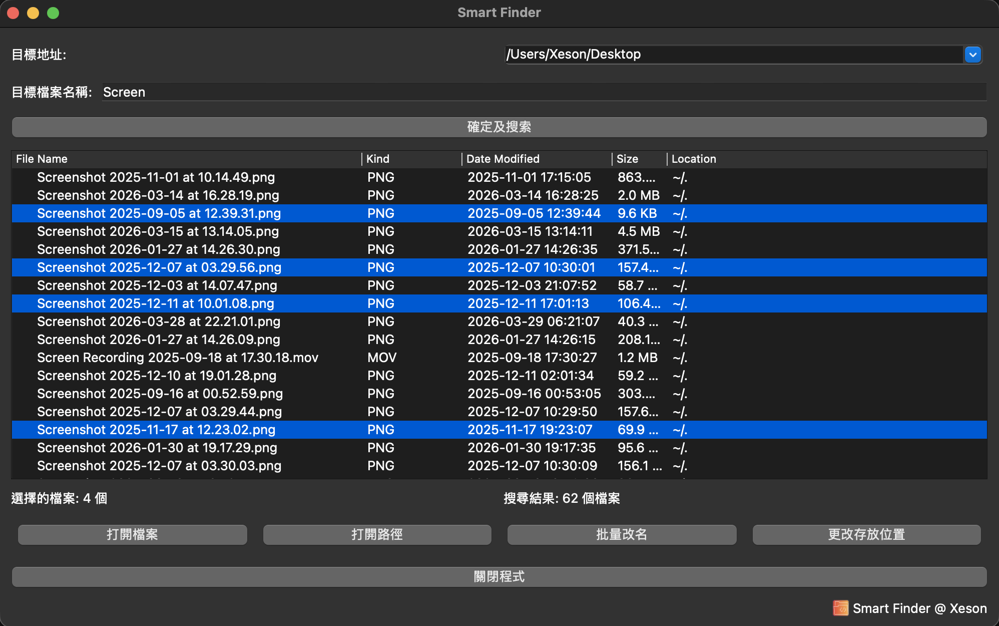

# Smart Finder

**A smart file search & batch management tool for macOS**

[](https://www.apple.com/macos/)
[](https://www.python.org/)
[](https://pypi.org/project/PyQt5/)
[](https://github.com/XesonHKer/SmartFinder/releases/latest)
[](#license)

[Features](#-features) • [PDF Compression](#-pdf-compression) • [Download & Install](#-download--install) • [Usage](#-usage) • [FAQ](#-faq) • [Changelog](#-changelog)

> **中文版**：[繁體中文說明](#-中文版)

---

## 📖 Overview

**Smart Finder** is a macOS desktop application built with PyQt5 that enhances Finder's file management capabilities. Search for files by keyword across directories, then perform **batch operations** — open, rename, move, or compress PDFs — all from one interface.

> Ideal for designers, video editors, document managers, and anyone dealing with large file collections.

---

## ✨ Features

- 🗜️ **PDF Compression (v9.0.0)** — Quality slider with real-time size estimation. Compress PDFs to 15%~70% of original size.
- 🚀 **Ghostscript Bundled (v9.0.2)** — No more `brew install ghostscript`! GS is now packed inside the `.app`. Works out of the box.
- 🌐 **Bilingual UI (v8.1.0)** — Full **English / 繁體中文** support for all buttons, labels, dialogs, and column headers.
- 🎚 **Language slider (v8.1.0)** — Instant toggle between `EN ⇄ 中文` at the bottom-left corner — no restart needed.
- 💾 **Language persistence (v8.1.0)** — Your choice is saved in `Smart_Finder_settings.json`; defaults to **English** on first launch.
- 🔍 **Fuzzy search** — Recursively search target directories for files matching your keyword.
- 🗂 **Detailed file info** — Name, type (Word / Excel / PDF / MOV / MP3 / AI / PSD…), date modified, size, and relative path.
- 🕘 **Recent directories** — Automatically remembers the last 5 directories you searched.
- 📂 **Batch open** — Open multiple files at once with the default system app (warns if >5 files).
- 📍 **Batch open location** — Jump to Finder folders for all selected files (deduplicated).
- ✏️ **Batch rename**:
  - **Add Prefix** — prepend text to filenames
  - **Add Suffix** — insert text before the extension
  - **Full Rename** — rename with auto-numbering (e.g. `Photo_01.jpg`, `Photo_02.jpg`)
- 🚚 **Batch move** — Move selected files to a new location with duplicate detection.
- 🛡 **Robust error handling** — Graceful handling of missing files, permission errors, and corrupted JSON.
- 🍎 **Native macOS experience** — Custom Dock icon, app icon, and standalone `.app` bundle.

---

## 🖼 Preview

> Main window: target directory input, filename input, search button, sortable results table, action toolbar.





---

## 🗜️ PDF Compression

Since **v9.0.2**, Ghostscript is bundled inside the `.app` — **no setup required**. Just download and run.

| Quality Level | Estimated Size | Typical Use Case |
|:---:|:---:|:---|
| High (90-100) | ~35% of original | Archival quality |
| Medium (40-75) | ~11-30% of original | Good balance |
| Low (0-20) | ~4-7% of original | Email attachment |

> ⚡ Real-time size estimation as you drag the slider. Press **Compress** and get instant feedback with elapsed time, GS output, and a **Cancel** button.

---

## 📦 Download & Install

### macOS

1. Go to the [Releases](https://github.com/XesonHKer/SmartFinder/releases/latest) page.
2. Download the latest `SmartFinder-v9.0.2-macOS-arm64.zip`.
3. Double-click to unzip, then drag `SmartFinder.app` to your **Applications** folder.
4. **First launch**: if you see "cannot be opened because the developer cannot be verified":
   - Open **System Settings → Privacy & Security**, click **Open Anyway**; or
   - Run `xattr -dr com.apple.quarantine /Applications/SmartFinder.app`
5. **Done!** PDF compression works immediately — no extra installs.

---

## 🚀 Usage

| Step | Action |
|:---:| --- |
| 1️⃣ | Enter or select a **target directory** (last 5 are remembered). |
| 2️⃣ | Type a **filename keyword** (case-insensitive fuzzy match). |
| 3️⃣ | Click **"Confirm & Search"** — results appear in the table. |
| 4️⃣ | Select one or more files (⌘ / ⇧ for multi-select). |
| 5️⃣ | Use the action buttons: **Open Files**, **Open Location**, **Batch Rename**, **Change Save Location**, **Compress PDF**. |
| 6️⃣ | (v8.1.0) Drag the **language slider** at bottom-left to switch between `EN ⇄ 中文` in real time. |

---

## 🔧 System Requirements

- **OS**: macOS 10.13 (High Sierra) or later
- **Chip**: Apple Silicon (M1/M2/M3/M4) or Intel
- **Python**: 3.9+ (when running from source)
- **Dependencies**: PyQt5
- **PDF compression**: Built-in since v9.0.2

---

## 🛠 Build from Source

```bash
cd src/V9.0.2
chmod +x build_app.sh
./build_app.sh
# => dist/SmartFinder.app (~28 MB)
```

**Requirements**: Python 3.11, PyQt5 (`pip install pyqt5`), PyInstaller (`pip install pyinstaller`)

### Project Structure

```
SmartFinder/
├── src/V9.0.2/          # Latest source code
│   ├── SmartFinder_v9_0_2.py   # Main application
│   ├── pdf_compressor.py       # PDF compression module
│   ├── gs_bundle/              # Bundled Ghostscript
│   ├── Icon/                   # App icons
│   ├── SmartFinder.spec        # PyInstaller config
│   └── build_app.sh            # Build script
├── CHANGELOG.md        # Version history
├── README.md           # This file
├── Preview.png         # Screenshot
└── .gitignore
```

---

## ❓ FAQ

**Q1: Search is slow — what can I do?**  
A: Search speed depends on the number of files in the target directory. Try selecting a more specific subdirectory.

**Q2: "Can't be opened because the developer is unverified"?**  
A: See [Download & Install](#-download--install) step 4 for the fix.

**Q3: Batch rename failed?**  
A: Check for duplicate filenames in the destination folder. The tool aborts if duplicates are detected.

**Q4: Can I use this on Windows / Linux?**  
A: The PyQt5 source code has cross-platform potential, but some functions (e.g., `os.system('open …')`) are macOS-specific. Modify as needed.

**Q5: (v8.1.0) How do I switch the UI language?**  
A: Drag the slider at the bottom-left — `EN` (left) for English, `中文` (right) for Traditional Chinese. Your choice is saved automatically.

**Q6: (v9.0.0) Do I need to install anything for PDF compression?**  
A: **Not since v9.0.2.** Ghostscript is bundled inside the `.app`. For v9.0.1 and earlier, run `brew install ghostscript`.

**Q7: What if I don't need PDF compression?**  
A: No problem — search, rename, and move features work independently.

---

## 📋 Changelog

> See [CHANGELOG.md](CHANGELOG.md) for full version history.

| Version | Date | Highlights |
|:---|:---:|---|
| **v9.0.2** | 2026-05-11 | 🚀 GS Bundled in-app, PDF compression OOTB, cancel button |
| v9.0.1 | 2026-05-11 | 🐛 Fixed PDF UI freeze → QProcess, real-time progress |
| v9.0.0 | 2026-04-29 | 🗜️ PDF compressor with quality slider |
| v8.1.0 | 2026-04-29 | 🌐 Bilingual EN/中文, language slider |
| v8.0.0 | — | Initial release: file search, batch rename/move |

---

## 📜 License

MIT License © Xeson

---

## 🙋‍♂️ Author

**Xeson** — [@XesonHKer](https://github.com/XesonHKer)

Report bugs or suggest features via [Issues](https://github.com/XesonHKer/SmartFinder/issues).

> ⭐ If Smart Finder helps you, please give it a star!

---

<!-- ======================================================== -->
<!--                     中文版                                -->
<!-- ======================================================== -->

<a name="-中文版"></a>
# Smart Finder — 繁體中文說明

**一款專為 macOS 設計的智能檔案搜尋與批量管理工具**

[](https://www.apple.com/macos/)
[](https://github.com/XesonHKer/SmartFinder/releases/latest)

> [English version ↑](#-smart-finder)

---

## 📖 簡介

**Smart Finder** 是一款基於 PyQt5 開發的 macOS 桌面應用，讓你能夠在指定資料夾中快速搜尋符合關鍵字的檔案，並提供一鍵批量打開、批量改名、批量搬移、PDF 壓縮等高效操作。

## ✨ 功能特色

- 🚀 **v9.0.2：Ghostscript 內建打包** — 不再需要手動安裝 Ghostscript，下載即用 PDF 壓縮！
- 🗜️ **PDF 壓縮** — 品質拉桿即時預估大小，壓縮至原大小的 15%~70%
- 🌐 **English / 繁體中文 雙語介面**，即時切換
- 🔍 **智能模糊搜尋**、批量打開、批量改名、批量搬移

## 🗜️ PDF 壓縮

自 **v9.0.2** 起 Ghostscript 已內建於 `.app` 中，**無需額外安裝**。選擇 PDF → 拖動品質拉桿 → 按壓縮，即可完成。

## 📦 下載安裝

1. 前往 [Releases 頁面](https://github.com/XesonHKer/SmartFinder/releases/latest) 下載 `SmartFinder-v9.0.2-macOS-arm64.zip`
2. 解壓後將 `SmartFinder.app` 拖入「應用程式」資料夾
3. 若出現「無法驗證開發者」：**系統設定 → 隱私權與安全性 → 仍要打開**
4. PDF 壓縮功能開箱即用！

## 📋 更新紀錄

| 版本 | 日期 | 重點 |
|:---|:---:|---|
| **v9.0.2** | 2026-05-11 | 🚀 GS 內建打包，取消按鈕，PDF 壓縮開箱即用 |
| v9.0.1 | 2026-05-11 | 🐛 修復 PDF 壓縮 UI 卡死 → QProcess，即時進度 |
| v9.0.0 | 2026-04-29 | 🗜️ PDF 壓縮功能 |
| v8.1.0 | 2026-04-29 | 🌐 雙語介面 (English / 中文) |

## 💬 作者

**Xeson** — 問題回報或功能建議請至 [Issues](https://github.com/XesonHKer/SmartFinder/issues)。